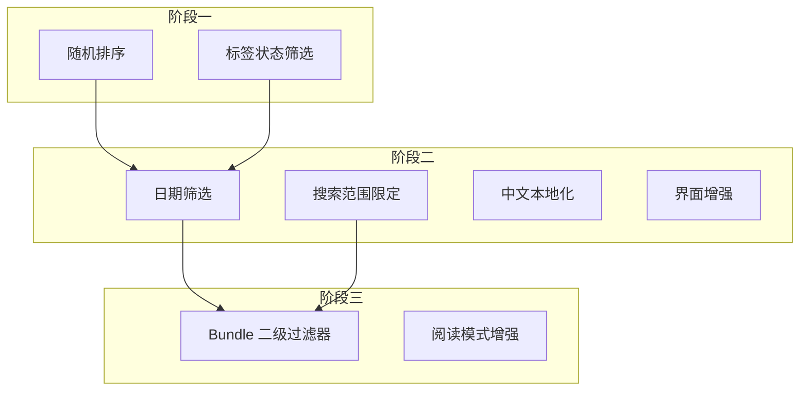

# linkding-cn 功能迁移计划

本文档基于 [linkding-cn-merge-analysis.md](linkding-cn-merge-analysis.md) 中的分析，列出各功能的详细迁移步骤与涉及文件。

---

## 迁移原则

- 以当前项目（linkding 1.45.0）为基础，按功能逐项迁移
- 每个功能独立分支，迁移后单独测试
- 优先迁移低依赖、高价值功能
- 适配 Django 6、Python 3.13、pyproject.toml

---

## 阶段一：低难度功能（预估 2–4 天）

### 1. 随机排序

**难度**：低 | **依赖**：无

| 步骤 | 操作 | 涉及文件 |
|------|------|----------|
| 1 | 新增排序常量 | [bookmarks/models.py](bookmarks/models.py) `BookmarkSearch` |
| 2 | 扩展 `params`、`defaults`、`__init__` | 同上 |
| 3 | 实现随机排序逻辑 | [bookmarks/queries.py](bookmarks/queries.py) `_base_bookmarks_query` |
| 4 | 表单增加排序选项 | [bookmarks/forms.py](bookmarks/forms.py) `BookmarkSearchForm` |
| 5 | 模板/前端增加排序控件 | 搜索相关模板 |
| 6 | 单元测试 | `bookmarks/tests/` |

**实现要点**：`order_by("?")` 实现随机，注意分页时保持同一随机序列（可用 `seed` 或缓存）。

---

### 2. 标签状态筛选（有标签/无标签）

**难度**：低 | **依赖**：无

| 步骤 | 操作 | 涉及文件 |
|------|------|----------|
| 1 | 新增 `FILTER_TAGGED_*` 常量 | [bookmarks/models.py](bookmarks/models.py) `BookmarkSearch` |
| 2 | 扩展 `params`、`defaults`、`__init__` | 同上 |
| 3 | 查询中增加 tagged 过滤 | [bookmarks/queries.py](bookmarks/queries.py) |
| 4 | 表单增加 tagged 选项 | [bookmarks/forms.py](bookmarks/forms.py) |
| 5 | 模板增加筛选控件 | 搜索相关模板 |
| 6 | 单元测试 | `bookmarks/tests/` |

**实现要点**：`tagged=yes` 用 `Q(tags__isnull=False)`，`tagged=no` 用 `Q(tags__isnull=True)`，注意去重。

---

## 阶段二：中等难度功能（预估 4–8 天）

### 3. 日期筛选（绝对日期 + 相对日期）

**难度**：中 | **依赖**：`python-dateutil`（可选，可用标准库）

| 步骤 | 操作 | 涉及文件 |
|------|------|----------|
| 1 | 新增 `date_filter_by`、`date_filter_type`、`date_filter_start`、`date_filter_end`、`date_filter_relative_string` | [bookmarks/models.py](bookmarks/models.py) `BookmarkSearch` |
| 2 | 实现 `parse_relative_date_string`（today、yesterday、this_week、last_N_days 等） | 同上 |
| 3 | 在 `_base_bookmarks_query` 中应用日期过滤 | [bookmarks/queries.py](bookmarks/queries.py) |
| 4 | 表单增加日期选择控件 | [bookmarks/forms.py](bookmarks/forms.py) |
| 5 | 模板增加日期筛选 UI | 搜索相关模板 |
| 6 | 单元测试 | `bookmarks/tests/` |

**实现要点**：参考 linkding-cn 的 `BookmarkSearch.parse_relative_date_string`，支持 `today`、`yesterday`、`this_week`、`this_month`、`last_N_days` 等。

---

### 4. 搜索范围限定（标题、描述、笔记、URL）

**难度**：中 | **依赖**：无

| 步骤 | 操作 | 涉及文件 |
|------|------|----------|
| 1 | 扩展搜索语法，支持 `in:title`、`in:description`、`in:notes`、`in:url` | [bookmarks/services/search_query_parser.py](bookmarks/services/search_query_parser.py) |
| 2 | 在 `_convert_ast_to_q_object` 中根据 scope 限定搜索字段 | [bookmarks/queries.py](bookmarks/queries.py) |
| 3 | 文档与 UI 提示新语法 | 搜索模板、文档 |

**实现要点**：当前 `TermExpression` 已搜索 title/description/notes/url，需增加可选的 scope 参数，由解析器传入。

---

### 5. 中文本地化

**难度**：中 | **依赖**：无（Django 内置）

| 步骤 | 操作 | 涉及文件 |
|------|------|----------|
| 1 | 为所有用户可见字符串添加 `gettext`/`gettext_lazy` | 模板 ``、``；Python 中 `gettext_lazy` |
| 2 | 创建中文 locale | `bookmarks/locale/zh_Hans/LC_MESSAGES/` |
| 3 | 运行 `makemessages`、`compilemessages` | - |
| 4 | 配置 `LANGUAGES`、`LOCALE_PATHS` | [bookmarks/settings/base.py](bookmarks/settings/base.py) |
| 5 | 用户/系统语言选择（可选） | UserProfile 或环境变量 |

**涉及范围**：`bookmarks/templates/`、`bookmarks/forms.py`、`bookmarks/models.py`（choices 文本）、`bookmarks/views/`、`bookmarks/admin.py`。

---

## 阶段三：高难度功能（预估 6–12 天）

### 7. Bundle 二级过滤器与 search_params

**难度**：高 | **依赖**：日期筛选等（若已迁移） | **状态**：已简化实现

| 步骤 | 操作 | 涉及文件 | 状态 |
|------|------|----------|------|
| 1 | BookmarkBundle 增加 `search_params` (JSONField) | [bookmarks/models.py](bookmarks/models.py) | ✅ 已实现 |
| 2 | 与现有 `filter_unread`、`filter_shared` 兼容 | 保留现有字段，search_params 通过 `get_search_overrides` 合并 | ✅ 已实现 |
| 3 | search_params 支持 `tagged`、`date_filter` | [bookmarks/models.py](bookmarks/models.py)、[bookmarks/queries.py](bookmarks/queries.py) | ✅ 已实现 |
| 4 | Bundle 表单：标签状态、日期筛选（相对时间） | [bookmarks/forms.py](bookmarks/forms.py)、[bookmarks/templates/bundles/form.html](bookmarks/templates/bundles/form.html) | ✅ 已实现 |
| 5 | URL 预填支持 `!last_7_days` 等日期关键词 | [bookmarks/queries.py](bookmarks/queries.py)、[bookmarks/views/bundles.py](bookmarks/views/bundles.py) | ✅ 已实现 |
| 6 | `show_count`、`is_folder` | - | ⏸ 暂不实现 |
| 7 | 排序、必需标签、排除标签、绝对日期 | - | ⏸ 暂不实现 |

---

### 8. 阅读模式增强（无快照也可阅读）

**难度**：中 | **依赖**：无 | **状态**：已移除

阅读模式功能已移除。

---

### 9. 自定义元数据/快照脚本（drissionpage）

**难度**：高 | **依赖**：`drissionpage`（重依赖）

| 步骤 | 操作 | 涉及文件 |
|------|------|----------|
| 1 | 评估是否引入 drissionpage | 依赖体积、维护成本 |
| 2 | 配置支持自定义脚本路径 | 环境变量或 UserProfile |
| 3 | 元数据获取、快照任务调用自定义脚本 | [bookmarks/services/website_loader.py](bookmarks/services/website_loader.py)、[bookmarks/services/singlefile.py](bookmarks/services/singlefile.py) |
| 4 | 安全：脚本沙箱或白名单路径 | - |

**建议**：可延后或作为可选功能，优先完成其他迁移。

---

## 暂不实现

以下功能在迁移过程中已简化或暂不纳入实现范围：

| 功能 | 说明 |
|------|------|
| 界面增强（粘性、滚动、折叠记忆） | 搜索面板的粘性定位、滚动状态、折叠状态记忆（阶段二 B4） |
| 标签中文拼音（pypinyin） | 中文标签按拼音分组/排序，依赖 pypinyin 库 |
| favicon 快速筛选 | 按 favicon 筛选书签的界面功能 |
| 回收站 | 软删除、还原、永久删除、批量操作，需新增 is_deleted 等字段 |

---

## 迁移顺序建议

**推荐实施顺序**：

1. 随机排序、标签状态筛选（快速见效）
2. 日期筛选、搜索范围限定
3. 中文本地化、界面增强
4. Bundle 二级过滤器、阅读模式增强
5. 自定义脚本（可选）

---

## 工作量汇总

| 阶段 | 功能数 | 预估人天 | 风险 |
|------|--------|----------|------|
| 阶段一 | 2 | 2–4 | 低 |
| 阶段二 | 4 | 4–8 | 中 |
| 阶段三 | 2+ | 4–8 | 高 |
| **合计** | **8+** | **10–20** | - |

---

## 参考

- [linkding-cn GitHub](https://github.com/WooHooDai/linkding-cn)
- [linkding-cn-merge-analysis.md](linkding-cn-merge-analysis.md)
